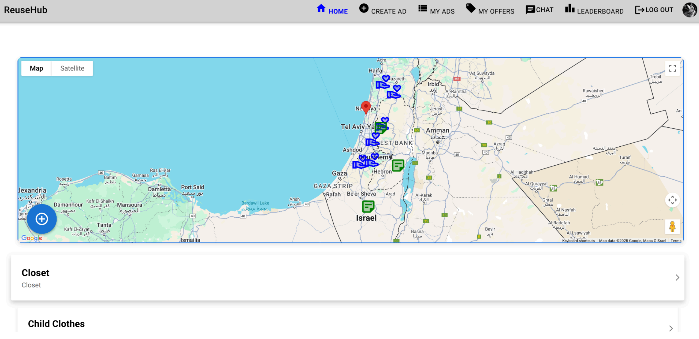
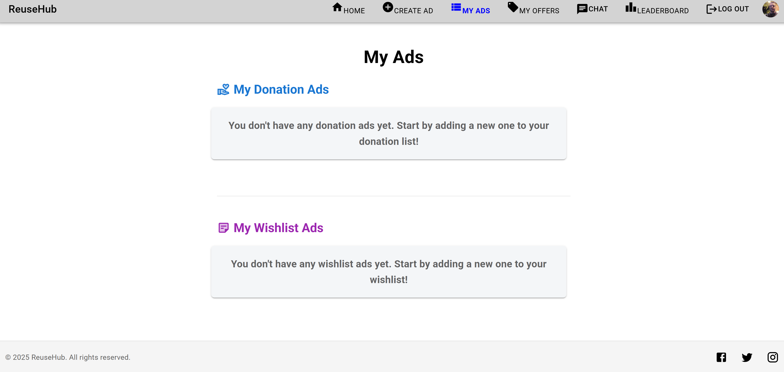
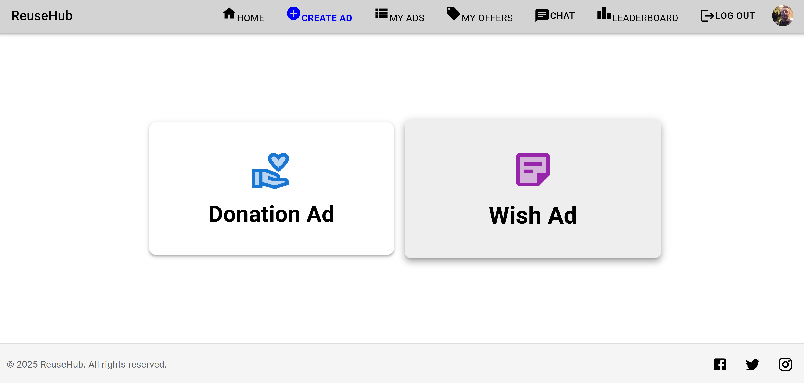
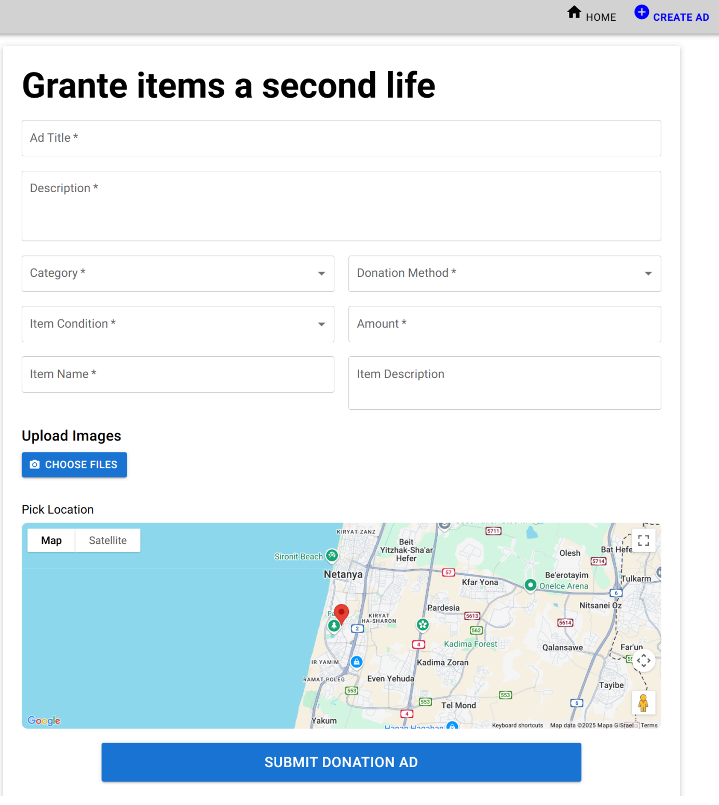
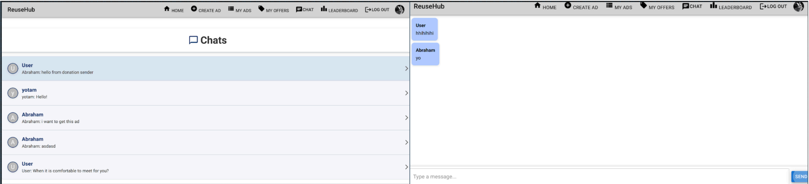
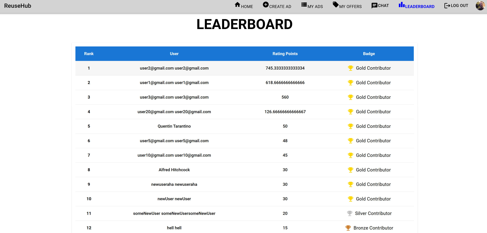
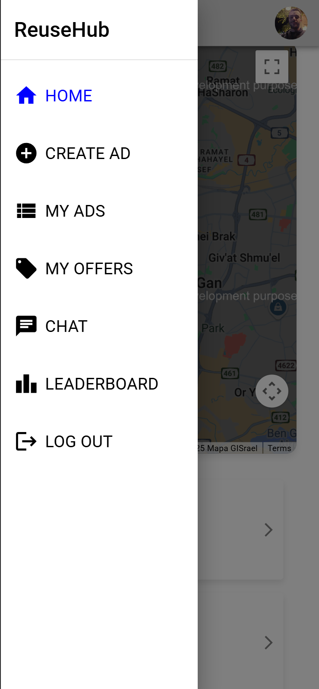

# ReuseHub

ReuseHub is a full-stack MERN web application that promotes sustainability by enabling users to donate and request second-hand items through an intuitive, near real-time map-based interface which visualizes offers,Adsetc.. and via chat. The platform empowers communities to reduce waste and reuse valuable items through real-time collaboration, gamified incentives, and location-based search.

---

## 📸 Screenshots

### 🗺️ Homepage with Interactive Map


### 📦 My Ads Page
A personalized dashboard showing all ads created by the logged-in user, with options to edit or delete.


### 🪄 Create Ad Modal (Floating Prompt)
Interactive modal that allows quick access to creating either a donation or wishlist ad.


### ➕ Create Donation Ad


### 💬 Real-Time Chat with WebSocket


### 📈 Leaderboard Page
Displays top contributors in the community with gamification elements like points and badges.


### 📱 Mobile Responsiveness
Example of how the platform adapts gracefully to smaller screen sizes on mobile devices.


*(Screenshots available in `/docs/screenshots`)*

---

##  Features

### 🔄 Real-Time Item Exchange System
- Post donation or wishlist ads with images, description, and geolocation
- Ads auto-update across all clients using **Socket.IO**

### 🗺️ Interactive Google Maps Integration
- See donation/wishlist ads near you
- Clickable item markers with filters by category, type, and condition

### 👥 Community Engagement
- Gamification: badges, points, and leaderboard ranking
- User profiles with ratings based on successful exchanges

### 💬 Real-Time Messaging & Offers
- Built-in chat using WebSockets
- Users can submit, accept, or reject offers directly through the interface

### 🔐 Secure Authentication
- JWT-based login and registration
- Role-based access and secure password hashing

---

## 🧱 Tech Stack

| Layer             | Technology                                        |
|------------------|---------------------------------------------------|
| Frontend         | React.js, Material UI, Google Maps API            |
| Backend          | Node.js, Express.js, Socket.IO                    |
| Database         | MongoDB + Mongoose (2dsphere indexing for geo)    |
| Hosting          | Netlify (frontend), Render (backend)              |
| Auth & Security  | JWT, bcrypt, secure API design                    |

---

## 📁 Folder Structure

```
📦 reusehub/
├── backend/
│   ├── config/
│   ├── controllers/
│   ├── models/   ← Mongoose schemas with discriminator inheritance
│   ├── routes/
│   ├── services/ ← WebSocket integration (socket.io)
│   └── utils/    ← JWT, validation, etc.
├── frontend/
│   ├── src/
│   │   ├── ads/
│   │   ├── createAd/
│   │   ├── homePage/
│   │   ├── offers/
│   │   ├── chat/
│   │   ├── leaderboard/
│   │   ├── registration/
│   │   ├── shared/ ← Components, map, layout, jwt guard
│   │   └── styles/
└── README.md
```

---

## ⚙️ Setup Instructions

### Prerequisites
- Node.js v18+
- MongoDB local or Atlas
- Google Maps API key

### Backend

```bash
cd backend
npm install
npm run dev
```

### Frontend

```bash
cd frontend
npm install
npm start
```

Create a `.env` file in both frontend and backend folders with:

```env
# Backend .env
MONGO_URI=your_mongodb_url
JWT_SECRET=your_secret_key

# Frontend .env
REACT_APP_GOOGLE_MAPS_API_KEY=your_maps_key
REACT_APP_BACKEND_URL=http://localhost:5000
```

---

## 📊 System Architecture

The system follows a 3-tier architecture:

- **Presentation Tier:** React + Material UI + Google Maps (Netlify)
- **Service Tier:** Express + Socket.IO + JWT (Render)
- **Data Tier:** MongoDB Atlas + Mongoose with geospatial indexing

Refer to the diagrams in `the SDD / project book`.

---

## ✅ Testing & Validation

- ✅ **Unit Tests** with Jest (frontend & backend)
- ✅ **Integration Tests** using Postman
- ✅ **Load Testing** with JMeter and k6 for Socket.IO
- ✅ **Security Audits** with OWASP ZAP

---

## 🧩 Future Features

- Mobile native app (React Native or Flutter).
- publish our complete API in Postman.
- Moderation tools (admin panel for content control).
- Bulk donation uploads (CSV/API).
- Scheduled pickups with calendar view.

---

## 👥 Authors

- Yotam Greenstein — [GitHub](https://github.com/yotamgr314)  
- Rodion Novakovski  
---
